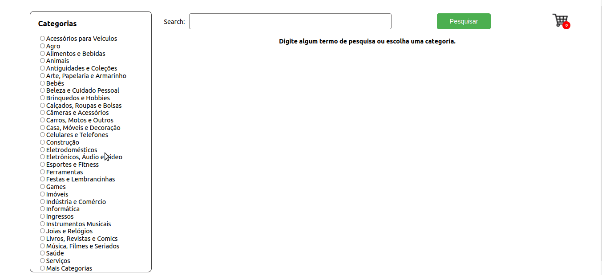

# About the project / *Sobre o projeto*

This project is a simplified version of an **online store**, where users can:
   - Search for products by terms and categories from the _Mercado Livre API_;
   - Add and remove items from a shopping cart in different quantities;
   - View details and previous reviews of a product, as well as create new reviews;
   - Finalize the (simulated) purchase of the selected items.
The activity was developed in a group using the agile methodology SCRUM and according to demands defined in a _Kanban_ board, in a scenario closer to the job market.

---

*Esse projeto é uma versão simplificada de uma **loja online**, onde os usuários podem:*
  *- Buscar produtos por termos e categorias a partir da _API do Mercado Livre_;*
  *- Adicionar e remover itens de um carrinho de compras em diferentes quantidades;*
  *- Visualizar detalhes e avaliações prévias de um produto, bem como criar novas avaliações;*
  *- Finalizar a compra (simulada) dos itens selecionados.*
*A atividade foi desenvolvida em grupo através da metodologia ágil SCRUM e de acordo com demandas definidas em um quadro _Kanban_, em um cenário mais próximo ao do mercado de trabalho.*

---
# Skills / *Habilidades*

 - HTML, CSS, Javascript
 - React
 - API manipulation / *Manipulação API*
 - Local Storage

---
# Layout

---
# Deployment / *Implantação*

See it in action/ **Veja em ação**: [https://kelsonbatista.github.io/project-online-store/](https://kelsonbatista.github.io/project-online-store/)
